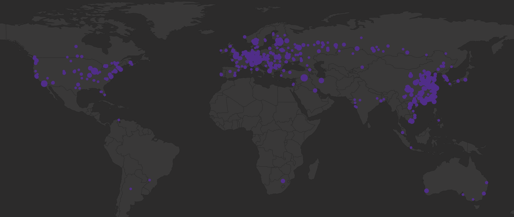

# My Learning on Subspace Network

Developer's guide for Subspace Network

## Overview

We will start with these:

1. [ ] 🧑🏻‍💻 How to async handle the file edits (CRUD) operations?
2. [ ] How to handle Rocks DB (CRUD)?
3. [ ] How to handle Trie data structures and how is it useful for blockchain?
4. [ ] How to use libp2p for DSN?
5. [ ] How to use clap for making commands for your code snippets or set of functions?
6. [x] How to create a subspace node?
7. [x] How to create a subspace farmer?
8. [x] How to create a subspace farm/plot?
9. [x] How to scan for solution in subspace farms/plots?
10. [x] How to exit a node after running few blocks?
11. [ ] How to trace logs in CLI for async tasks?

## Repositories

> Look at the pinned repositories on Subspace's [page](https://github.com/subspace).

- [subspace](https://github.com/subspace/subspace)
- [astral](https://github.com/subspace/astral)
- [space-acres](https://github.com/subspace/space-acres)
- [subnomicon: The Subspace Network Protocol Knowledge Base](https://github.com/subspace/subnomicon)
- [subspace-docs: Official Documentation for Subspace Labs & the Subspace Network](https://github.com/subspace/subspace-docs)

## Developer

As a developer, it's suggested to go through the substrate resources collated [here](https://github.com/abhi3700/My_Learning_Substrate/) by me.

## Tools

### Explorer

- Astral (for both Consensus, Nova chains):
  - [Gemini-3h Consensus](https://explorer.subspace.network/#/gemini-3h/consensus)
  - [Gemini-3g Consensus](https://explorer.subspace.network/#/gemini-3g/consensus)
- Blockscout (for Nova EVM chain)
- **Polkadot.js** (for Consensus chain):
  - [Gemini-3h](https://polkadot.js.org/apps/?rpc=wss%3A%2F%2Frpc-0.gemini-3h.subspace.network%2Fws%20#/explorer)
  - [Gemini-3g](https://polkadot.js.org/apps/?rpc=wss%3A%2F%2Frpc-0.gemini-3g.subspace.network%2Fws#/explorer)
- **Subscan** (for Consensus chain):
  - [Gemini-3h](https://subspace.subscan.io/)

### RPC

> Here, instead of RESTful APIs, GraphQL are preferred. It is more efficient as we can fetch multiple data at once, rather than requesting server for each endpoints separately.
>
> NOTE: GraphQL data is slow by 10 blocks due to indexing.

- Gemini-3g:
  - Nova graphQL URL: <https://nova.squid.gemini-3g.subspace.network/graphql>
  - Nova API URL: <https://nova.gemini-3g.subspace.network/ws>
  - Consensus graphQL URL: <https://squid.gemini-3g.subspace.network/graphql>
- Gemini-3h
  - Nova graphQL URL: <https://nova.squid.gemini-3h.subspace.network/graphql>
  - Nova API URL: TODO: Add this
  - Consensus graphQL URL: <https://squid.gemini-3h.subspace.network/graphql>

### Telemetry

Subspace telemetry is available at <https://telemetry.subspace.network/#stats/0x0c121c75f4ef450f40619e1fca9d1e8e7fbabc42c895bc4790801e85d5a91c34>.
You also get to view the nodes distributed geographically like this:

There is a repo: [substation](https://github.com/subspace/substation) (last updated 2 years ago) that is fork of [paritytech/substrate-telemetry](https://github.com/paritytech/substrate-telemetry).

## References

- [Building a P2P Database in Rust](https://medium.com/dev-genius/building-a-p2p-database-in-rust-d120cf6f1dd2)
- [Getting started with Tracing](https://tokio.rs/tokio/topics/tracing)
- [Next steps with Tracing](https://tokio.rs/tokio/topics/tracing-next-steps)
